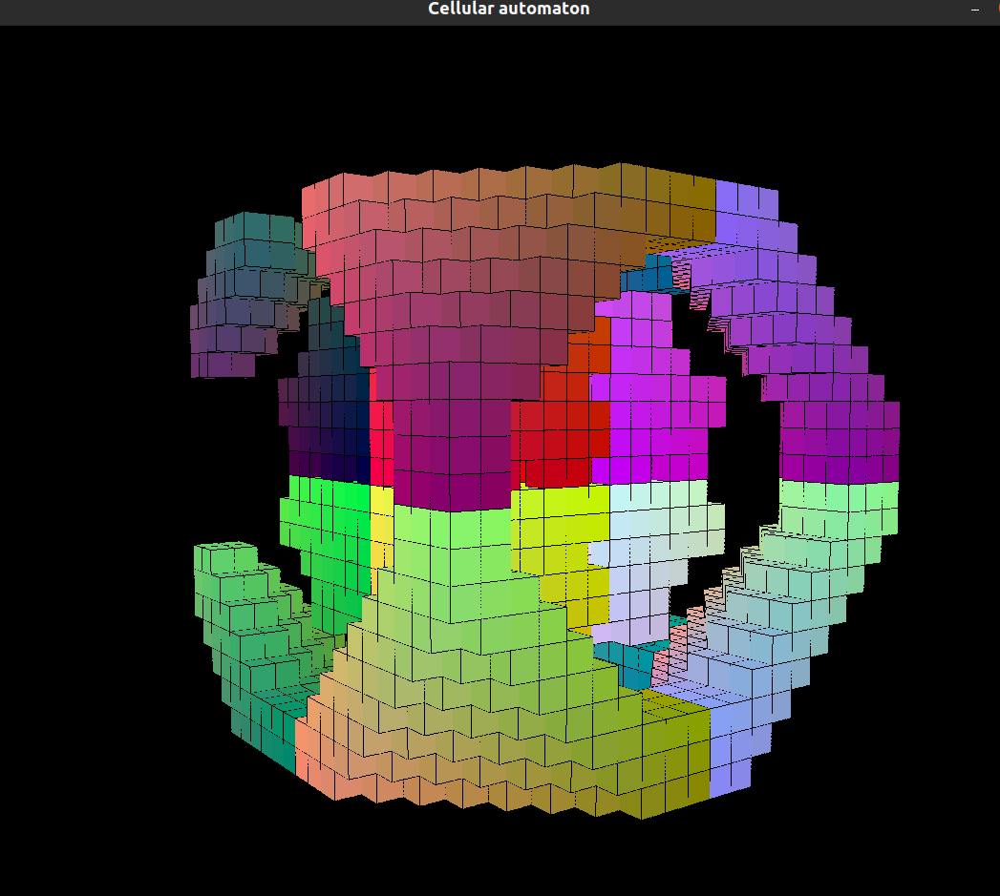
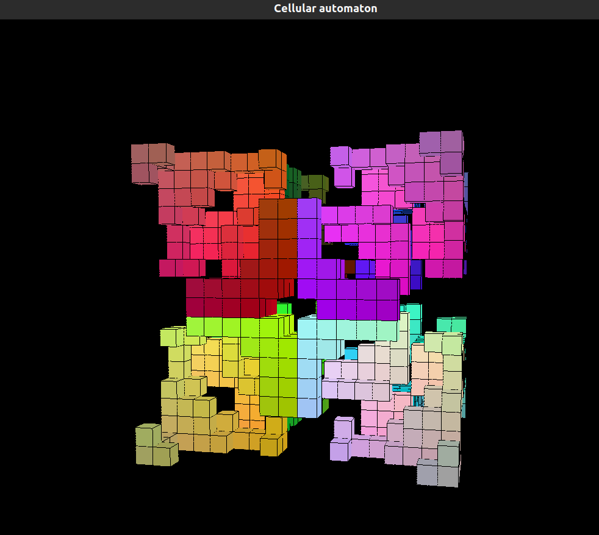
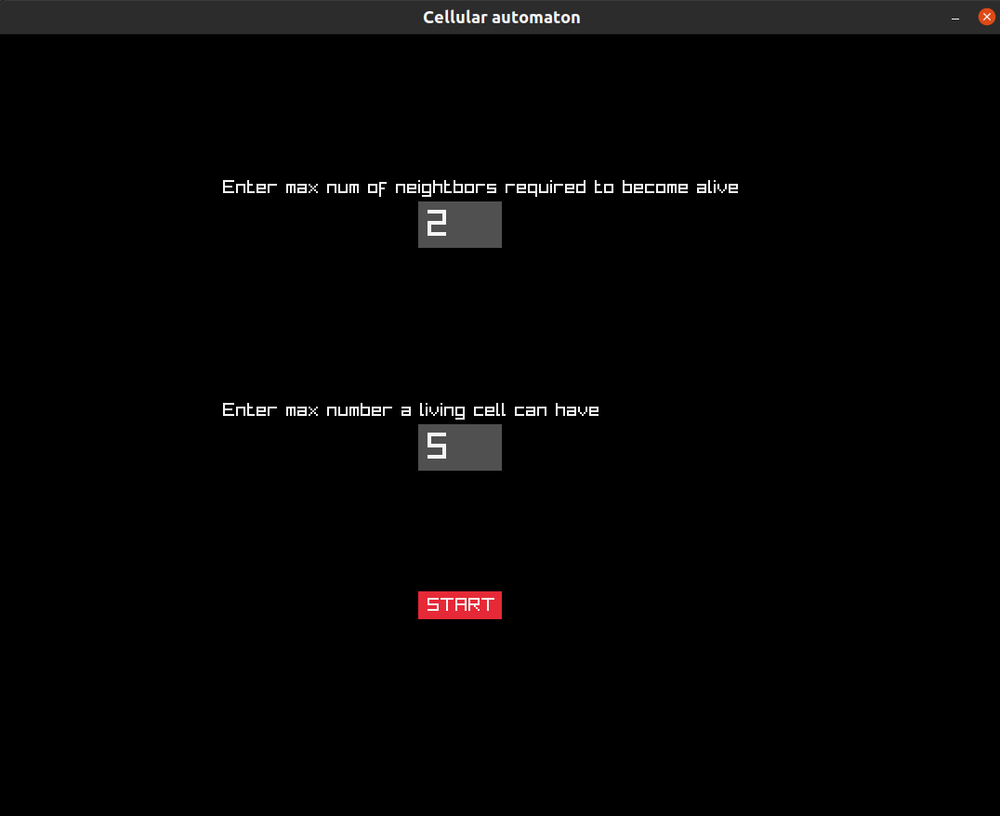

# 3DGameOfLife
Small pet project to showcase a tridimensional implementation of Conway's Game of Life

## About
This is a simple experiment using [Raylib](https://www.raylib.com/) to visualize a small 20x20x20 world populated by
cubes (cells) that can be either visible (alive) or invisible (dead). Depending on what parameters you choose, their behavior will change. Cubes can either die or survive between iterations depending on the amount of neightbors each individual cell has.

(Neightbor check uses [Moore's neightborhood](https://en.wikipedia.org/wiki/Moore_neighborhood))

## A note on Emergent Behavior
This sort of behavior describes the complex ways numerous things can do obeying only simple rules. Conway's game of Life is
a perfect example of this concept, as cells obey very simple rules while displaying eye-catching behaviors.
[More about this](https://en.wikipedia.org/wiki/Emergence)

### Some screenshots

